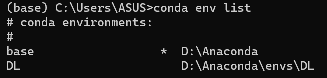
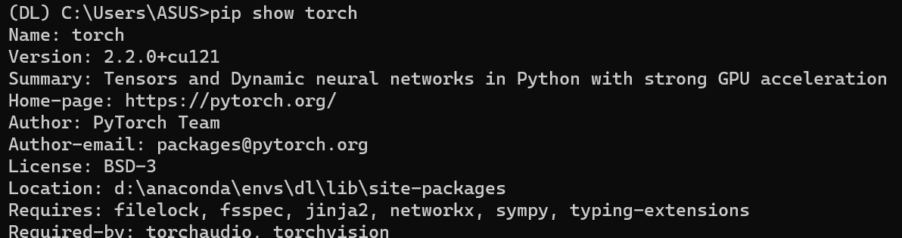

# 编程与开发环境设置
---
## 一、安装IDE
直接上官网安装VScode和pycharm
https://code.visualstudio.com/ 
和https://www.jetbrains.com/pycharm/download
## 二、安装 Anaconda 
* 在中国大学镜像源地址下载anaconda
https://mirrors.bfsu.edu.cn/anaconda/archive/
* 安装此版本
其基础环境（base环境）下的Python为3.9版本
* 在**D盘**下创建一个文件夹名为Anaconda，并将安装的Anaconda放在这个文件夹里
* **编辑系统环境变量**，在弹出的“系统属性”窗口中点击“环境变量”，再在弹出的“环境变量”窗口中选择path路径，并点击编辑。通过右侧的“新建”按钮，可新建环境变量的路径，将
【D:Anaconda】
【D:Anaconda\Scripts】与【D:Anaconda\Library\bin】添加到环境变量。
* 创建==桌面快捷方式==，点击菜单搜索Jupiter notebook点击打开文件位置，将Anaconda Prompt和Jupyter Notebook发送到桌面
## 三、创建Python虚拟环境
点击Prompt进入Anaconda的环境中，接下来的命令均在Prompt中执行。
* base 环境下的操作
```py
#列出所有的环境
conda env list
#创建名为“环境名”的虚拟环境，并指定Python的版本
conda create -n 环境名 python=3.9
#创建名为“环境名”的虚拟环境，并指定Python的版本与安装路径
conda create -prefix= 安装路径\环境名 python=3.9
#进入名为“环境名”的虚拟环境
conda activate 环境名
```

## 四、安装CUDA
在官网上下载
https://developer.nvidia.com/cuda-toolkit-archive
并选择版本13.0.0，选择Windows X86_64 11 exe(local)
## 五、安装PyTorch
官网https://pytorch.org/get-started/previous-versions/
在相应的虚拟环境下运行以下指令
```
conda install pytorch==2.2.0 torchvision==0.17.0 torchaudio==2.2.0 pytorch-cuda=12.1 -c pytorch -c nvidia
```
安装好后查看一下torch版本

## 六、安装常用工具包
使用中科大的镜像源安装numpy Pandas和Matplotlib
通过指令```conda activate DL```进入到DL虚拟环境
```py
# 安装NumPy库，并指定版本1.23.5
pip install numpy==1.23.5 -i https://pypi.mirrors.ustc.edu.cn/simple/

# 安装Pandas库，并指定版本1.5.2
pip install pandas==1.5.2-i https://pypi.mirrors.ustc.edu.cn/simple/

# 安装Matplotlib库，并指定版本3.5.1
pip install matplotlib==3.5.1 -i https://pypi.mirrors.ustc.edu.cn/simple/
```
## 七、Python 相关问题解答
---
### Python 与 C 语言的区别

- **类型**：Python 是解释型、动态类型语言；C 是编译型、静态类型语言
- **语法**：Python 语法简洁，C 语法更底层复杂  
- **内存管理**：Python 自动垃圾回收，C 需要手动管理内存
- **性能**：C 运行效率高，Python 开发效率高
- **用途**：Python 适合 Web、数据分析、AI；C 适合系统编程、嵌入式
---
### 如何用命令行运行 Python 程序
* 打开Anaconda Prompt 命令行终端
* 运用`conda activate 环境名`切换至虚拟环境
* 运用`cd`命令切换到python文件相应路径
* 输入`python filename.extension`运行文件
---
### 需要 python 虚拟环境的原因

主要目的是==项目隔离==，避免不同项目库之间的**版本冲突**，并且能使系统环境保持**干净**和**稳定**，也可以同时管理多个Python解释器
### 不使用 conda 指令的情况下使用指定虚拟环境的方法
* 如果conda在PATH中可直接运行`activate venvname`
* 也可以在cmd中运行`python -m venv venvname`创建虚拟环境，然后输入`venvname\Scripts\activate`进入虚拟环境