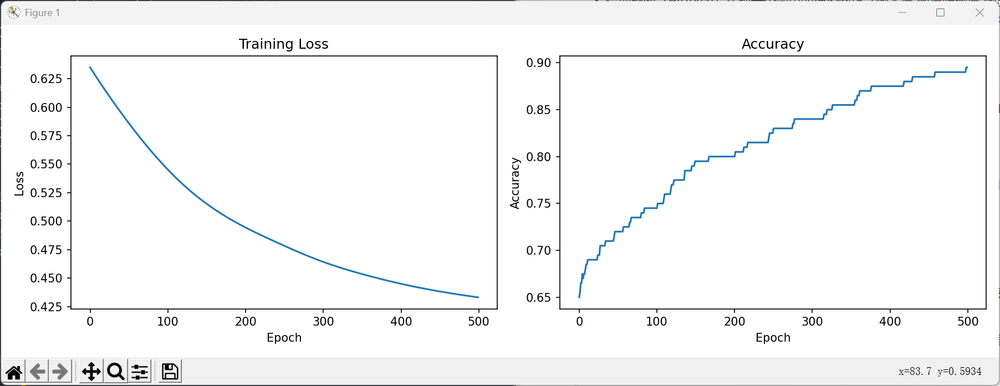
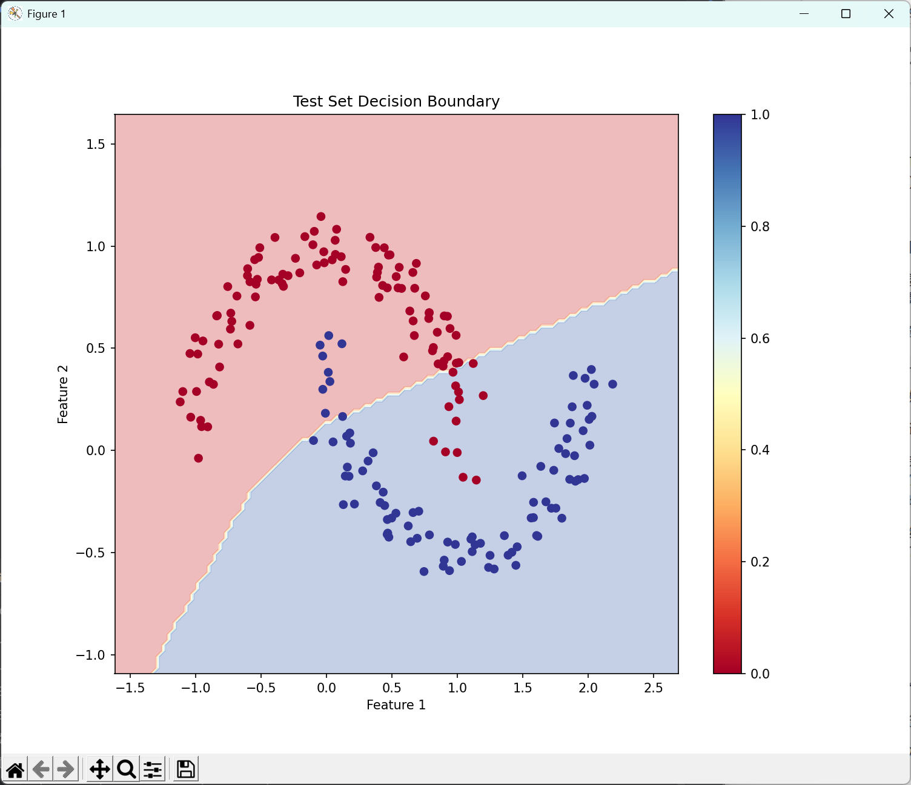
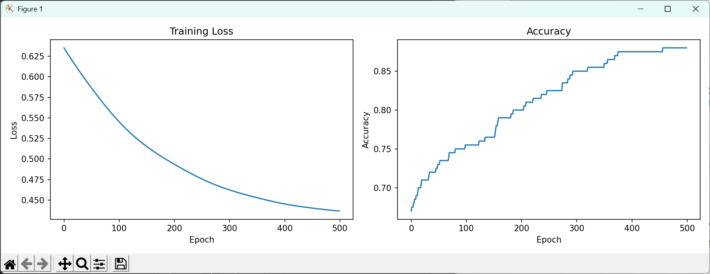
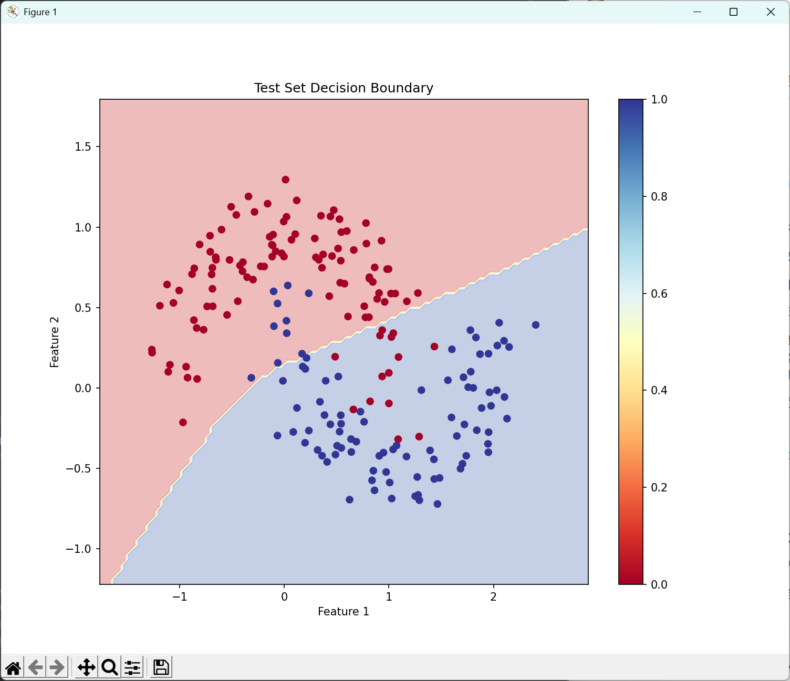

# 代码实践相关问题的解答
---
## 一、神经网络的架构

从两个神经元，到十六个神经元，再到两个神经元
## 二、噪声调整前后效果
`noise = 0.1`

`noise = 0.2`

很明显，噪声越大，模型效果约不理想
## 三、保证所有类别概率和为一的方法
#### 1. 对于二分类问题：Sigmoid 函数
* 原理
Sigmoid 函数将一个实数值"挤压"到 (0, 1) 的区间内
* 公式
`P = 1 / (1 + e^x)`
这里的 `x` 是模型最后一个线性层的输出。

#### 2. 对于多分类问题（≥2类）：Softmax 函数
* 原理
Softmax 函数接收一个包含 K 个 实数的向量，并将其转换成一个概率分布。
* 公式
对于第 `i` 个类别的概率 `P(i)`，其计算公式为：
`P(i) = e^(z_i) / (e^(z_1) + e^(z_2) + ... + e^(z_K))`
#### 核心特性
- **归一化**：分母是所有类别指数的总和，这确保了所有输出概率的总和严格等于 1
- **输出范围**：每个输出值都在 (0, 1) 区间内
