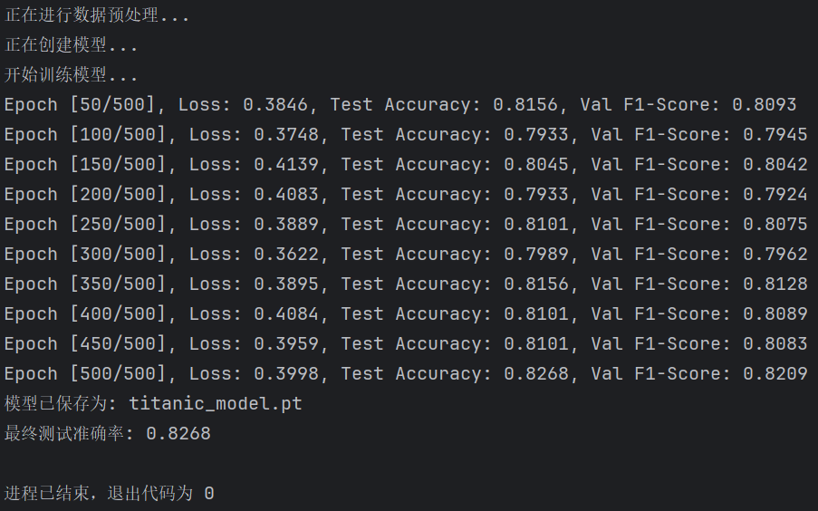
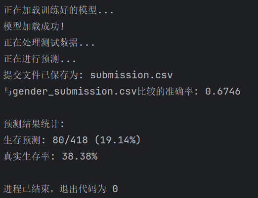

# 泰坦尼克号生存预测模型实验报告

## 实验概述

本实验基于泰坦尼克号乘客数据，构建了一个深度学习模型来预测乘客的生存情况。通过数据预处理、特征工程、模型训练和评估等步骤，最终得到了一个在验证集上准确率达到82.68%的预测模型。

## 模型架构

### 网络结构
- **输入层**：8个特征
- **隐藏层**：3个全连接层（64→32→16个神经元）
- **输出层**：2个神经元（生存/死亡）
- **正则化**：使用Batch Normalization和Dropout(0.3)防止过拟合
- **激活函数**：ReLU

### 训练参数
- **优化器**：Adam (learning_rate=0.01, weight_decay=0.001)
- **损失函数**：CrossEntropyLoss
- **训练轮数**：500 epochs
- **批量大小**：64

## 实验结果

### 训练过程表现
最终测试准确率: 0.8268
训练损失: 0.3998 (最终epoch)

- 模型在训练过程中表现稳定，损失逐渐下降
- 验证集准确率在79%-83%之间波动
- 最终达到82.68%的准确率

### 测试集预测结果
与**gender_submission.csv**比较的准确率: 0.6746
生存预测: 80/418 (19.14%)
真实生存率: 38.38%

### 测试集表现明显下降，可能原因：
1. 训练集与测试集分布差异
2. 模型过拟合训练数据
3. gender_submission.csv作为基准的局限性
---
## 实验过程中对模型的调整
### 尝试网络不同深度和宽度

```py
architectures = [
    [32, 16, 8],      # 更小的网络
    [128, 64, 32],    # 更大的网络  
    [64, 32, 16, 8]   # 更深的网络
]
```
### 调整正则化强度
```py
weight_decays = [0.0001, 0.001, 0.01]
dropouts = [0.2, 0.3, 0.4, 0.5]
```
### 尝试不同的学习率
```py
learning_rates = [0.001, 0.005, 0.01, 0.05]
```