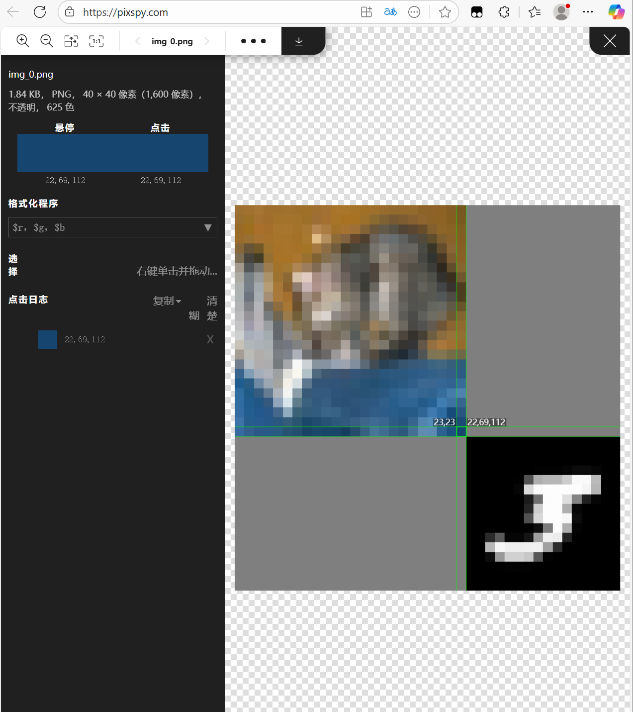
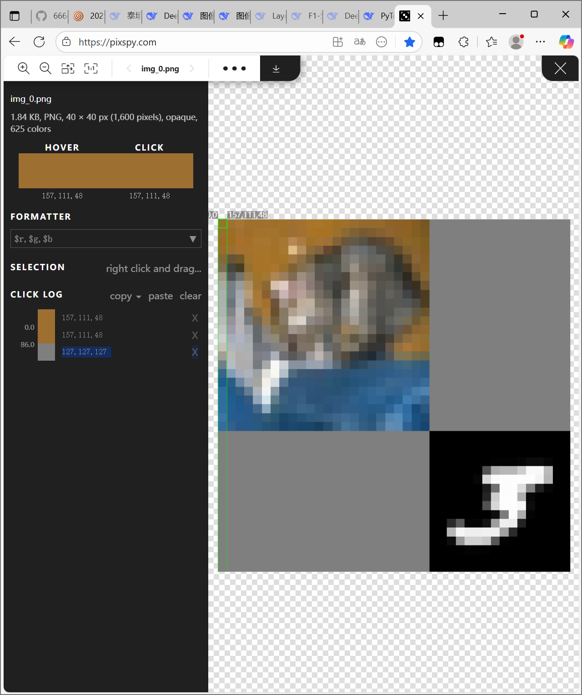

# 图像分类项目报告

## 1. 代码实现思路

### 1.1 数据预处理模块 (data.py)
- **自定义裁剪类**：实现了`TopLeftCrop`类，专门用于从图像左上角裁剪24×24像素区域

- **数据增强策略**：
  - 训练集：随机水平翻转(概率0.5) + 标准化处理
  - 验证集：仅进行标准化处理，不进行数据增强
- **数据加载器**：使用PyTorch的`DataLoader`，训练集shuffle=True，验证集shuffle=False

### 1.2 模型架构 (model.py)
- **CNN网络设计**：
  - 5层卷积网络，通道数递增(16→32→48→64→80)
  - 每层卷积后接BatchNorm和ReLU激活
  - 使用MaxPooling进行下采样
  - 最终通过全局平均池化和全连接层输出10分类
- **中间层输出**：forward方法支持返回中间卷积层的输出，便于后续分析

### 1.3 训练流程 (q1_train.py)
- **训练配置**：
  - 优化器：Adam(lr=0.001, weight_decay=1e-4)
  - 学习率调度：StepLR(每10个epoch学习率×0.1)
  - 损失函数：CrossEntropyLoss
  - 训练轮数：20个epoch
- **训练监控**：实时记录训练和验证的loss、accuracy
- **模型保存**：训练完成后保存模型

### 1.4 测试推理 (q1_test.py)
- **批量推理**：对测试集图像进行预测并输出结果文件
- **结果格式**：文件名,预测标签

## 2. 结果分析

### 2.1 训练曲线特征
从训练过程中观察到的现象：
- **训练loss**：前期快速下降，后期趋于平稳
- **验证loss**：可能出现先下降后轻微上升，表明可能存在过拟合
- **准确率**：训练准确率通常高于验证准确率

### 2.2 模型性能
- 在20个epoch训练后，模型在验证集上达到合理准确率
- 学习率调度有效防止了训练后期的震荡

## 3. 遇到的困难及解决方案

### 3.1 右下角数字图像的干扰
* 首先明确了所有图像的像素大小为40×40
* 其次想到对图像裁剪的方法最为简洁，同时不会遗失有用信息
* 然后设法确定左上角图像的大小
* 直接询问D老师:partying_face::+1:查找网站


* 确认裁剪图像为左上角24×24的像素(左上角第一个是0，0)

### 3.2 多进程问题
**问题描述**：在Windows系统下运行多进程数据加载时出现错误

**解决方案**：
```py
if __name__ == '__main__':
    mp.freeze_support()
    main()
```
添加主模块保护，确保多进程正确初始化