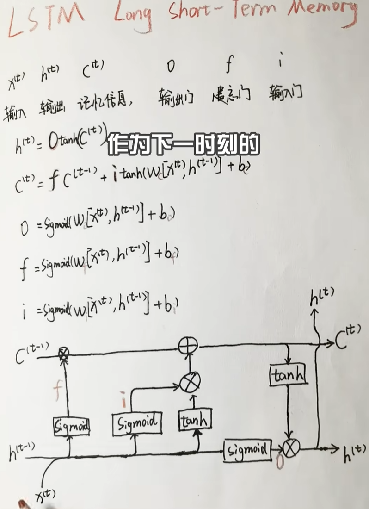

# NLP相关基础知识的学习
---
## RNN,LSTM
### 1. RNN（循环神经网络）

#### 基本原理
RNN是一类用于处理==序列==数据的神经网络。它的核心思想是：网络会对序列中的每个元素执行相同的操作，同时将上一个元素的“隐藏状态”传递到下一个元素的处理中。这个隐藏状态可以被看作网络的“记忆”，它包含了之前所有序列元素的历史信息。

#### 核心公式
`h_t = f(W * x_t + U * h_{t-1} + b)`

其中：
- `h_t` 是当前时刻的隐藏状态
- `x_t` 是当前时刻的输入
- `h_{t-1}` 是上一时刻的隐藏状态
- `W, U, b` 是可学习的参数（输入的权重，隐藏的权重，偏置）
- `f`是激活函数

#### 优点
- **处理变长序列**：可以处理任意长度的输入序列
- **记忆功能**：理论上可以利用之前的所有历史信息
- **参数共享**：在不同时间步共享同一组参数，模型更紧凑

#### 缺点
- **梯度消失/爆炸问题**：在训练长序列时，梯度在反向传播过程中会连乘，可能导致梯度变得极小（消失）或极大（爆炸），使得模型难以学习长距离的依赖关系
- **顺序处理，计算效率低**：必须按顺序处理序列，无法进行并行计算（所以耗时较长）

### 2. LSTM（长短期记忆网络）

#### 基本原理
LSTM是RNN的一种变体，专门设计用来解决RNN的梯度消失问题。它通过引入“门控机制”来精细控制信息的流通

#### 三个核心门控机制

##### 遗忘门
决定从细胞状态中丢弃哪些信息
`f_t = σ(W_f * [h_{t-1}, x_t] + b_f)`

##### 输入门
决定将哪些新信息存入细胞状态
`i_t = σ(W_i * [h_{t-1}, x_t] + b_i)`

##### 输出门
决定当前时刻的输出基于细胞状态的哪些部分
`o_t = σ(W_o * [h_{t-1}, x_t] + b_o)`

#### 优点
- **有效解决梯度消失**：门控机制和细胞状态的设计使得模型能够学习长距离的依赖关系，性能远超普通RNN

#### 缺点
- **结构复杂，计算量大**：参数数量是普通RNN的四倍，训练和推理更慢
- **依然存在顺序依赖**：和RNN一样，无法进行并行计算
---
## 学不完哩:sob: