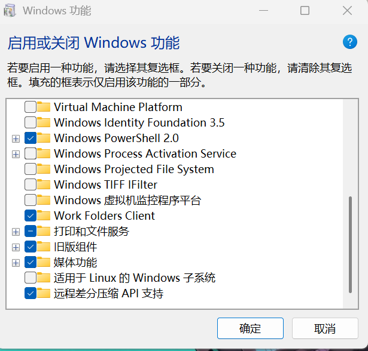
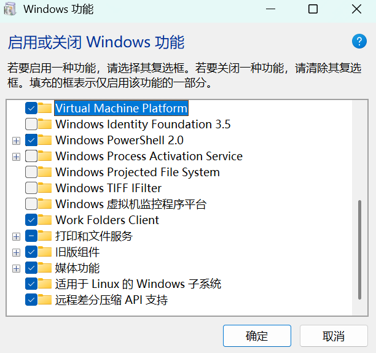
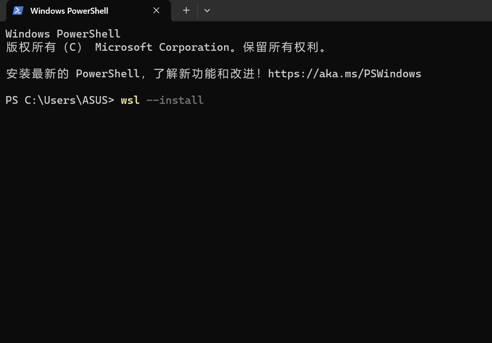

# WSL2的安装及配置Ubuntu
-----
## 一、对WSL和Ubuntu的简单了解
### 核心概念的理解:monocle_face:：
* **WSL** 是一个在 Windows 操作系统内部运行的、与 Windows 深度集成的==兼容层==。它允许你**直接**在 Windows 上运行原生的 **Linux** 命令行工具、应用程序和 Bash shell，而无需传统的虚拟机或双启动设置。
* **Ubuntu** 是一个以桌面应用为主的 ***Linux 发行版***，**Linux**严格来说只是操作系统的==核心==，==内核==，相当于汽车的**发动机**。人们将 **Linux 内核** 与各种==开源软件、程序库和桌面环境==打包在一起，形成一个完整的操作系统，这就是***发行版***。
### WSL2的优势：
* 轻量快速
* 内核完整（搭载真实linux内核，兼容性高）
* 无缝集成（与Windows深度互通）
### Ubuntu的优势
* 免费开源:partying_face:
* 稳定性强
* 软件生态完善
* 安全性高
------
## 二、安装过程展示
* ### 方式
    通过在**Powershell**运行指令==一键安装==:+1:
* ### 步骤
    #### 1. 启用Windows相应功能
    * 勾选**虚拟机平台**（*virtual machine platform*）和**适用于Linux的Windows子系统**，点击确定
    
    
    * 然后重启
    #### 2. 调出Powershell进行安装
    * 运行指令**WSL -install**
    
    * 系统默认安装**Ubuntu**发行版
    
    #### 3. 输入用户名并设置密码
    
    * 成功配置Ubuntu
----
## 三、问题及解决（都是些小问题:sweat_smile:）
* 一开始没有启用**windows**相应功能，导致指令未能成功运行
* 1.终端显示操作超时:thinking:
  
  2.询问D老师:heart_eyes:
  deepseek:whale:解释可能由于网络连接问题，无法从 GitHub raw 用户内容服务器下载文件导致的。GitHub 的 raw 域名在国内访问有时不稳定，可能会被防火墙拦截或连接超时。
  3.果断选择科学上网:upside_down_face:，挂梯子，成功解决:v:
--------
## 四、个人感想
一开始真的完全摸不着头脑:dizzy_face:，包括之前学git的时候，不过自己学完这些还是蛮有成就感的:sunglasses:，希望自己的付出能有回报吧。